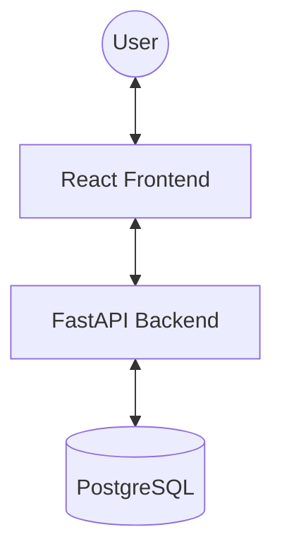
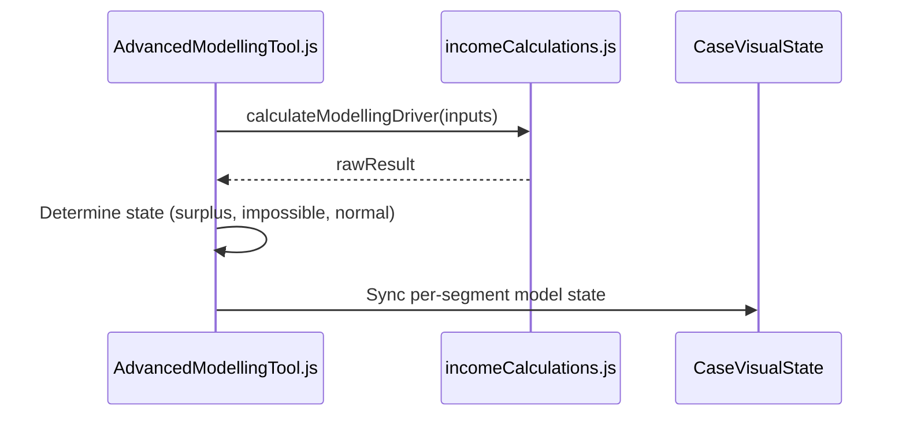

# Architecture: Income Driver Calculator (IDC)

## System Overview
The IDC is a classic three-tier web application designed for interactive data modeling and simulation.



## Tech Stack
- **Frontend**: React (Create React App), Ant Design, SCSS, CaseVisualState (Global Store)
- **Backend**: FastAPI (Python), SQLAlchemy, Alembic Migrations
- **Database**: PostgreSQL
- **Infrastructure**: Docker Compose (Local), Kubernetes (Production)

## Component Architecture (Modelling Tool)
The Advanced Modelling Tool follows a "Single Source of Truth" pattern using a localized state synced with a global store.



## Data Model
- **Case**: The root entity for a modeling session.
- **Segment**: A population subset with specific benchmarks and drivers.
- **Scenario**: Modelling configurations (Current, Feasible, Modelled).

## Authorisation & Data Isolation

The system enforces strict data isolation based on User Role and `user_type`. Access is calculated in the `get_all_case` route by building a whitelist of Case IDs (`user_cases`) and setting a `show_private` flag.

### Hierarchy Comparison

The IDC uses two parallel hierarchies to manage visibility:

| Entity | Context | Purpose |
| :--- | :--- | :--- |
| **Organisation** | **External (Partners)** | The "hard" security boundary for partners. All external users belong to one Organisation. |
| **Business Unit** | **Internal (IDH Staff)** | The functional boundary for staff. Internal users can see all *Public* cases but only *Private* cases within their BUs. |

### Access Matrix & Filtering Logic

| User Type | Visibility Criteria | `show_private` |
| :--- | :--- | :--- |
| **Super Admin / Admin** | All cases in the system (Public & Private) | `True` |
| **Internal User** | All Public cases + Owned cases + Shared cases | `True` |
| **External Advanced** | All cases in **Organisation** + Owned cases + Shared cases | `True` |
| **Company User** | All cases in **Company** + Owned cases + Shared cases | `False*` |
| **External Regular** | Owned cases + Shared cases | `False*` |

*\*Note: `show_private` is set to `True` for any user if they own the case or it is explicitly shared with them via the Viewer permission system.*

### Implementation Detail: The ID Whitelist Pattern

The backend builds a list of authorised IDs before querying the database. Here is the technical breakdown for each role:

#### 1. Super Admin / Admin
*   **Stage 1 (Route)**: Sets `show_private = True` and keeps `user_cases` empty (whitelist bypass).
*   **Stage 2 (CRUD)**: The logic in `crud_case.get_all_case` skips the `.filter(Case.private == 0)` check.

#### 2. Internal User (`user_type == internal`)
*   **Stage 1 (Route)**: Sets `show_private = True` and whitelists all public cases.
    ```python
    all_public_cases = crud_case.get_case_by_private(session, private=False)
    user_cases += [c.id for c in all_public_cases]
    ```
*   **Stage 2 (CRUD)**: The query filters the whitelist: `case.filter(Case.id.in_(user_cases))`.

#### 3. External Advanced (`user_type == external_advanced`)
*   **Stage 1 (Route)**: Sets `show_private = True` and whitelists all organisation cases.
    ```python
    org_cases = crud_case.get_case_by_organisation(session, user.organisation)
    user_cases += [c.id for c in org_cases]
    ```
*   **Stage 2 (CRUD)**: Database query joins on `User` to match `organisation_id`.

#### 4. Company User (`user.user_type == external_regular` and `user.company`)
*   **Stage 1 (Route)**: Whitelists all cases belonging to the specific company.
    ```python
    company_cases = crud_case.get_case_by_company(session, user.company)
    user_cases += [c.id for c in company_cases]
    ```
*   **Stage 2 (CRUD)**: `show_private` remains `False`, so only public company cases are returned unless specifically shared.

#### 5. Case Ownership & Shared Access (All Users)
*   **Stage 1 (Route)**: Every user gets their owned cases and specifically shared cases.
    ```python
    owned_cases = crud_case.get_case_by_created_by(session, user.id)
    shared_permissions = crud_uca.find_user_case_access_viewer(session, user.id)
    user_cases += [c.id for c in owned_cases] + [p.case for p in shared_permissions]
    ```
*   **Stage 2 (CRUD)**: `show_private` is dynamically enabled if the whitelist is non-empty, effectively allowing users to see their own private cases.

**Final SQLAlchemy Query Context:**
```python
# backend/db/crud_case.py

case = session.query(Case)
if not show_private:
    case = case.filter(Case.private == 0)
if user_cases: # Non-Admin whitelist
    case = case.filter(Case.id.in_(user_cases))
```

## Front-End Design Patterns

### Safe State Mutation (Pullstate)
To avoid race conditions during concurrent state updates (e.g., parallel data fetches clobbering each other), always use direct draft mutations in `update` calls instead of object spreading.

```javascript
// AVOID: Race condition risk
CaseUIState.update(s => ({ ...s, general: { ...s.general, flag: true } }));

// PREFERRED: Granular mutation or direct draft assignment
CaseUIState.update(s => { s.general.flag = true; });
```
