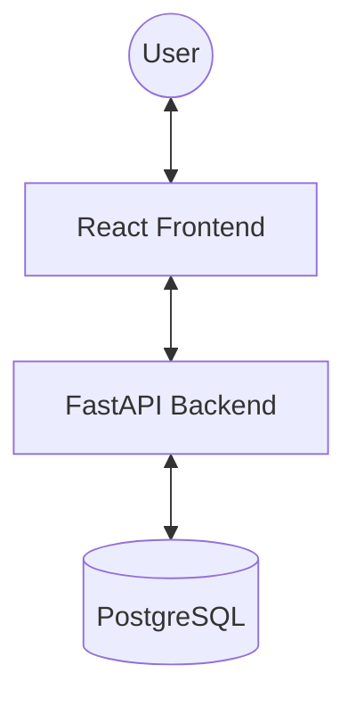
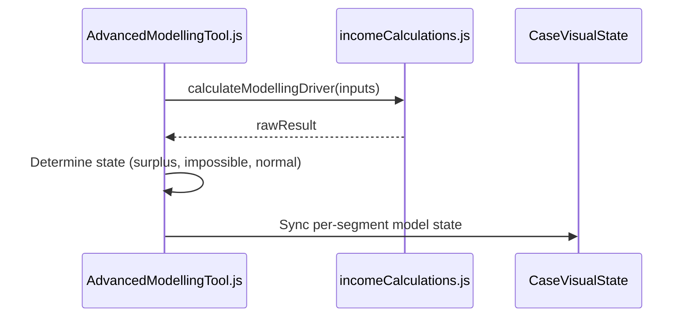

# Architecture: Income Driver Calculator (IDC)

## System Overview
The IDC is a classic three-tier web application designed for interactive data modeling and simulation.

## Tech Stack
- **Frontend**: React (Create React App), Ant Design, SCSS, CaseVisualState (Global Store)
- **Backend**: FastAPI (Python), SQLAlchemy, Alembic Migrations
- **Database**: PostgreSQL
- **Infrastructure**: Docker Compose (Local), Kubernetes (Production)

## Component Architecture (Modelling Tool)
The Advanced Modelling Tool follows a "Single Source of Truth" pattern using a localized state synced with a global store.

## Data Model
- **Case**: The root entity for a modeling session.
- **Segment**: A population subset with specific benchmarks and drivers.
- **Scenario**: Modelling configurations (Current, Feasible, Modelled).
