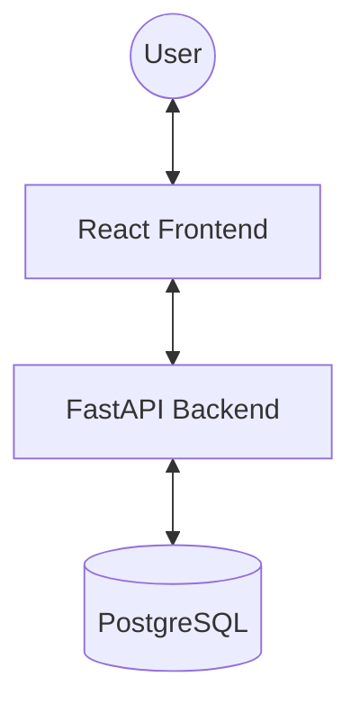
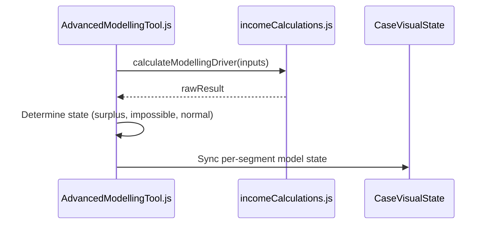

# Architecture: Income Driver Calculator (IDC)

## System Overview
The IDC is a classic three-tier web application designed for interactive data modeling and simulation.



## Tech Stack
- **Frontend**: React (Create React App), Ant Design, SCSS, CaseVisualState (Global Store)
- **Backend**: FastAPI (Python), SQLAlchemy, Alembic Migrations
- **Database**: PostgreSQL
- **Infrastructure**: Docker Compose (Local), Kubernetes (Production)

## Component Architecture (Modelling Tool)
The Advanced Modelling Tool follows a "Single Source of Truth" pattern using a localized state synced with a global store.



## Data Model
- **Case**: The root entity for a modeling session.
- **Segment**: A population subset with specific benchmarks and drivers.
- **Scenario**: Modelling configurations (Current, Feasible, Modelled).

## Authorisation & Data Isolation

The system enforces strict data isolation based on User Role and `user_type`.

### Hierarchy Comparison

The IDC uses two parallel hierarchies to manage visibility:

| Entity | Context | Purpose |
| :--- | :--- | :--- |
| **Organisation** | **External (Partners)** | The "hard" security boundary for partners. All external users belong to one Organisation. |
| **Business Unit** | **Internal (IDH Staff)** | The functional boundary for staff. Internal users can see all *Public* cases but only *Private* cases within their BUs. |

### Access Matrix

| User Type | Case Visibility | Admin Access |
| :--- | :--- | :--- |
| **Super Admin / Admin** | All cases in the system (Public & Private) | Full |
| **Internal User** | All Public cases + Business Unit cases + Owned cases | Restricted |
| **External Regular** | Owned cases + **Company** cases + Shared cases | None |
| **External Advanced** | All cases within their **Organisation** + Shared cases | None |

### Implementation: External Advanced Filtering

The `external_advanced` (Org Lead) visibility is enforced in the backend by broadening the case ID list to include all cases owned by anyone in the same organisation.

**Route Logic (`routes/case.py`):**
```python
if user.user_type == UserType.external_advanced:
    org_cases = crud_case.get_case_by_organisation(
        session=session, organisation_id=user.organisation
    )
    user_cases += [c.id for c in org_cases]
```

**CRUD Logic (`crud_case.py`):**
```python
def get_case_by_organisation(session: Session, organisation_id: int):
    return session.query(Case).join(User).filter(User.organisation == organisation_id).all()
```
