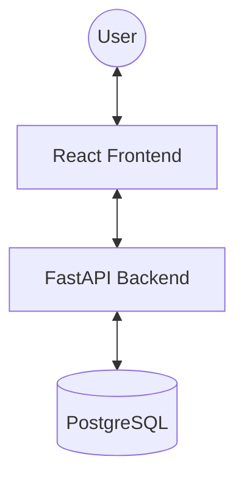
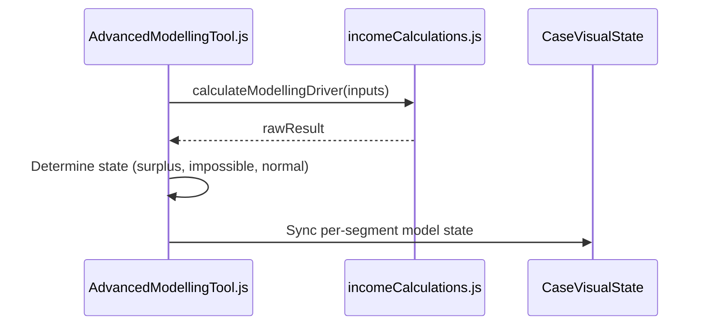

# Architecture: Income Driver Calculator (IDC)

## System Overview
The IDC is a classic three-tier web application designed for interactive data modeling and simulation.



## Tech Stack
- **Frontend**: React (Create React App), Ant Design, SCSS, CaseVisualState (Global Store)
- **Backend**: FastAPI (Python), SQLAlchemy, Alembic Migrations
- **Database**: PostgreSQL
- **Infrastructure**: Docker Compose (Local), Kubernetes (Production)

## Component Architecture (Modelling Tool)
The Advanced Modelling Tool follows a "Single Source of Truth" pattern using a localized state synced with a global store.



## Data Model
- **Case**: The root entity for a modeling session.
- **Segment**: A population subset with specific benchmarks and drivers.
- **Scenario**: Modelling configurations (Current, Feasible, Modelled).

## Authorisation & Data Isolation

The system enforces strict data isolation based on User Role and `user_type`. Access is calculated in the `get_all_case` route by building a whitelist of Case IDs (`user_cases`) and setting a `show_private` flag.

### Hierarchy Comparison

The IDC uses two parallel hierarchies to manage visibility:

| Entity | Context | Purpose |
| :--- | :--- | :--- |
| **Organisation** | **External (Partners)** | The "hard" security boundary for partners. All external users belong to one Organisation. |
| **Business Unit** | **Internal (IDH Staff)** | The functional boundary for staff. Internal users can see all *Public* cases but only *Private* cases within their BUs. |

### Access Matrix & Filtering Logic

| User Type | Visibility Criteria | `show_private` |
| :--- | :--- | :--- |
| **Super Admin / Admin** | All cases in the system (Public & Private) | `True` |
| **Internal User** | All Public cases + Owned cases + Shared cases | `True` |
| **External Advanced** | All cases in **Organisation** + Owned cases + Shared cases | `True` |
| **Company User** | All cases in **Company** + Owned cases + Shared cases | `False*` |
| **External Regular** | Owned cases + Shared cases | `False*` |

*\*Note: `show_private` is set to `True` for any user if they own the case or it is explicitly shared with them via the Viewer permission system.*

### Implementation Detail: The ID Whitelist Pattern

The backend builds a list of authorised IDs before querying the database:

1.  **Initialisation**: `user_cases = []`, `show_private = False`
2.  **Shared Access**: If the user has specific viewer permissions, IDs are added and `show_private = True`.
3.  **Internal Role**: If `len(user_business_units) > 0`, all Public cases are added and `show_private = True`.
4.  **Advanced Role**: If `user_type == external_advanced`, all cases in `user.organisation` are added and `show_private = True`.
5.  **Company Role**: If `user.company` is set, all cases in that company are added.
6.  **Ownership**: All cases where `created_by == user.id` are added and `show_private = True`.
7.  **Shared with Me**: If the `shared_with_me` flag is passed in the request, the list is *pruned* to only contain specifically shared viewer permissions.

**Final Query (`crud_case.py`):**
```python
case = session.query(Case)
if not show_private:
    case = case.filter(Case.private == 0)
if user_cases:
    case = case.filter(Case.id.in_(user_cases))
```
