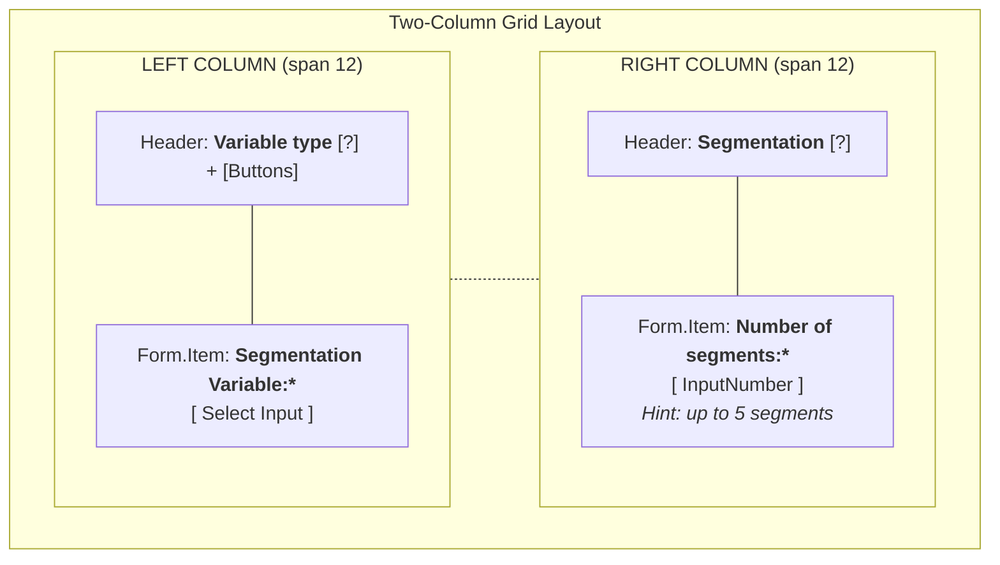

# UX Plan: Segmentation UI Alignment

## Overview
Based on the reference image provided, we need to restructure the segmentation configuration (Step 2 and Data Upload) to use a more horizontal, modern layout that improves space utilization and provides clearer hierarchical grouping.

## Visual Wireframe (Final Alignment)

## Proposed Changes

### 1. Two-Column Structural Layout
- **Container**: A single Ant Design `<Row gutter={[16, 16]}>`.
- **Column 1 (Left)**: Spans 12 columns. Contains:
    - **Header**: "Variable type" with tooltip and the button-style toggle on the same line.
    - **Field**: "Segmentation Variable:*" implemented via `Form.Item` with label above the input.
- **Column 2 (Right)**: Spans 12 columns. Contains:
    - **Header**: "Segmentation" with tooltip on the top line (aligned with the toggle row).
    - **Field**: "Number of segments:*" implemented via `Form.Item` with label above the input.
    - **Footer**: "You can select up to 5 segments" helper text.

### 2. Selection Toggle (Radio Button Refinement)
- **Component**: Button-style `Radio.Group` (`optionType="button"`, `buttonStyle="solid"`).
- **Placement**: Inline with the "Variable type" label in Column 1.

### 3. Technical Implementation Detail: `Form.Item` Integration
- **Field Wrapping**: Each input (`Select` and `InputNumber`) is wrapped in a `Form.Item`.
- **Label Positioning**: Labels are placed in the `label` prop of `Form.Item` to ensure standard Ant Design spacing and required markers.
- **Header Rendering**: Headers are rendered outside of the target `Form.Item` blocks to allow for the custom tooltip/toggle alignment.

## Interaction Patterns
- **Guided Selection**: The "Segmentation Variable" dropdown remains disabled until a "Variable type" is selected, maintaining the logical flow implemented in #737.
- **Dynamic Tooltips**:
    - **Variable type**: Explains the difference between categorical and numerical data.
    - **Segmentation**: Explains the purpose of dividing the farmer population.

## Component Impact
- `SegmentConfigurationForm.js` (Step 2)
- `DataUploadSegmentForm.js` (Generator inside Data Upload)

## Discussion Points
- Does this two-row structure work for all screen sizes (specifically 1280x720)?
- Are the tooltip contents sufficient?
- Should the "Segmentation" tooltip be different in Step 2 vs Data Upload?
