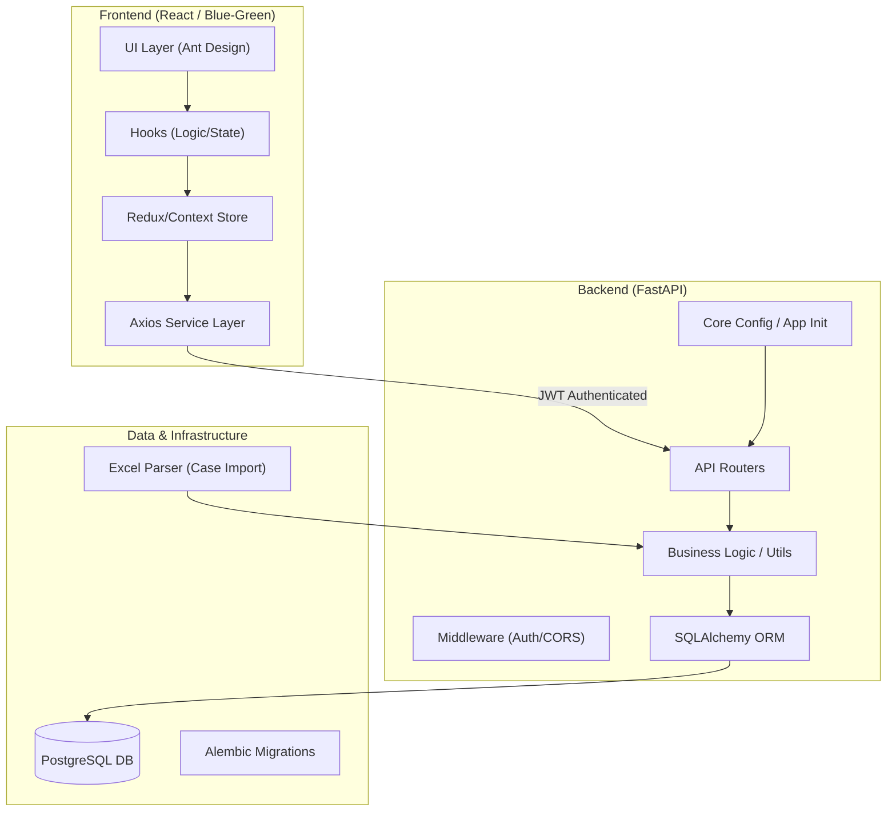

# Low-Level Design (LLD) - Income Driver Calculator (IDC)

This document provides a technical blueprint of the IDC platform's architecture, data models, and system components.

---

## 1. System Architecture

The IDC project follows a **decoupled Client-Server architecture** optimized for real-time modeling and data privacy.

### High-Level Module Decomposition

---

## 2. Detailed Data Catalog

The IDC database comprises 30+ tables, organized into functional clusters managed via **SQLAlchemy**.

### 1. Analytics
*   **Matomo Cloud**: Primary usage tracking implemented via global `_paq` and React hooks.
*   **Legacy Piwik Pro**: Decommissioned; Redundant initialization removed from `index.js`.

### A. Core Modeling Cluster
These entities manage the primary modeling lifecycle (Steps 1-5).

| Entity | Description |
| :--- | :--- |
| **Case** | Primary container for simulation data, year, and commodity focus. |
| **Segment** | Farmer groupings within a case (Max 5). |
| **SegmentAnswer** | Storage for Current/Feasible values mapped to Question IDs. |
| **Visualization** | JSON configuration for Step 4 & 5 dashboards (ROI, Advanced Modelling, Outcome charts). |
| **CaseCommodity** | Junction table for cases with diversified/multiple commodities. |
| **CaseImport** | Metadata for uploaded Excel templates; presence determines source (`import_id != null` => Upload). |

### B. Reference & Calculation Data
Stateless masters used for calculation engine defaults.

| Entity | Description |
| :--- | :--- |
| **Question** | Master list of all income drivers (ID, Public Key, Category). |
| **LivingIncomeBenchmark** | Living income values filtered by Country/Region. |
| **CPI** | Consumer Price Index data for inflation adjustments. |
| **Currency** | Exchange rates and unit symbols. |
| **ReferenceData** | External datasets (e.g., procurement costs) for benchmark modeling. |

### C. Access & Organization Cluster
Multi-tenant security and permission management.

| Entity | Description |
| :--- | :--- |
| **User** | System users with dynamic `user_type` and `role`. |
| **Organisation** | Top-level tenant (e.g., IDH, Partner Org). |
| **Company** | Specific subsidiary or business unit under an organization. |
| **UserCaseAccess** | Pivot table defining granular Editor/Viewer rights per Case. |
| **BusinessUnit** | Optional grouping for internal staff management. |

---

## 3. Communication Standards

### API Request/Response Pattern
- **RESTful**: standard headers and nested paths (e.g., `/case/{id}/segments`).
- **Schemas**: All inputs/outputs strictly validated via **Pydantic** models (found in `models/*.py`).
- **Security**: JWT-based Bearer authentication. Tokens are decoded in `middleware.py`.
- **Performance**: Heavy modeling logic (ROI) is performed on the frontend; backend persists the configuration state.

### Static Config Bridge (`config.js`)
The backend generates a `config.min.js` file at runtime (`core/config.py`). This file:
1.  Injects environment variables (Client ID, Secret).
2.  Pre-loads master data (Countries, Currencies) to prevent redundant API calls during hydration.
3.  Provides TopoJSON data for map-based visualizations.

---

## 4. Frontend Strategy

### State Management
- **Local State**: `useState` for UI-only toggles.
- **Shared State**: Proprietary hooks for Case/Segment synchronization across modelling steps.
- **Single Source of Truth (SSOT)**: Establishing `dashboardData` (Baseline) and `scenarioOutcomeDataSource` (Scenario) as global state targets. The `useScenarioCalculations` hook centralizes all income scenario math, ensuring consistency between Step 4 modeling and Step 5 ROI charts.
- **Persistence**: Temporary data held in memory; persistent state synced to Backend on "Save Case".
- **Segmentation Mutual Exclusivity**: Segmentation is restricted to a single source (Manual OR Upload). The `CaseForm.js` component enforces this via confirmation guards and destructive state clearing during tab switches.

### Service Layer
Located in `frontend/src/lib/`, the network layer abstracts Axios calls into dedicated service functions. No direct Axios usage is allowed inside components.

---

## 5. Security & Access Control

### Permissions Matrix (Granular)

| Action | Admin | Editor | Viewer |
| :--- | :---: | :---: | :---: |
| Create Case | ✅ | ✅ | ❌ |
| Edit Assigned Case | ✅ | ✅ | ❌ |
| View Assigned Case | ✅ | ✅ | ✅ |
| Manage All Users | ✅ | ❌ | ❌ |
| Access ROI Charts | ✅ | ✅ | ✅ |
| Export Data | ✅ | ✅ | ✅ |

---

## 6. Feature Specifications

To maintain a clean architectural blueprint, detailed feature logic is documented in standalone specification files.

| Feature Area | Key Specification Document | Coverage |
| :--- | :--- | :--- |
| **Segmentation** | [MUTUALLY_EXCLUSIVE_SEGMENTATION.md](features/MUTUALLY_EXCLUSIVE_SEGMENTATION.md) | Source-of-truth guards, Tab switches. |
| **ROI Analysis** | [ROI_INVESTMENT.md](features/ROI_INVESTMENT.md) | Calculations, Multipliers, ROI Charts. |
| **Modelling Tools** | [ADVANCED_MODELLING.md](features/ADVANCED_MODELLING.md) | Sensitivity Analysis, Advanced Modelling (Step 4). |
| **Income Analysis** | [INCOME_GAP_ANALYSIS.md](features/INCOME_GAP_ANALYSIS.md) | Gap Allocation, Composition Charts. |
| **Data Upload** | [DATA_UPLOAD_SEGMENTATION.md](features/DATA_UPLOAD_SEGMENTATION.md) | Template Parsing, Field Order logic. |
| **Permissions** | [PERMISSIONS.md](features/PERMISSIONS.md) | RBAC Matrix, View-Only restrictions. |
| **Case UX** | [CASE_MANAGEMENT_UX.md](features/CASE_MANAGEMENT_UX.md) | Save Guards, Cleanup scripts. |

---

## 7. Architecture Decision Records (ADRs)

### ADR-006: Strict 5-Segment Limit Enforcement
- **Status**: Accepted
- **Context**: Users were able to bypass the 5-segment limit during the "Update Case" flow by appending new data-upload segments to existing manual segments, leading to invalid states (> 5 segments).
- **Decision**:
    1.  **Global Model Enforcement**: Applied `max_length=5` to the `segments` field in Pydantic models (`CaseBase`, `CaseImport` requests). This ensures strict validation at the API entry point.
    2.  **UX Hardening (Delete-before-Upload)**: In Update Mode, the "Data Upload" tab is blocked if 5 segments are already present. Users must delete segments in the "Manual" tab before uploading new data.
    3.  **Persistence Transparency**: Integration tests verify that `422 Unprocessable Entity` is returned for any overflow attempts.
- **Alternatives Considered**: Proportional merging or automatic deletion of old segments. Both were rejected to preserve user data integrity.
- **Consequences**: Users must perform an intentional "Delete" action before switching data sources in Update Mode.

---

> [!IMPORTANT]
> **Data Privacy Check**: No PII (Personally Identifiable Information) beyond User Table (Email/Name) is stored. Individual farmer data is aggregated into segments before being saved to the database.
