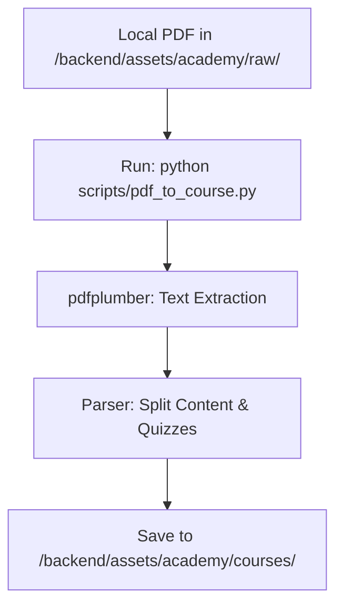

# LMS PoC — Implementation Specification

## 📊 Overview

### Purpose
The Learning Management System (LMS) PoC aims to provide a minimal, secure environment for IDH IDC users to access course materials and validate their knowledge through interactive quizzes.

### Key Principle
**Content-as-Data**: All course materials and quizzes are served as structured JSON, allowing for rapid iteration without heavy database migrations during the PoC phase.

### User Experience
- **Login**: Users authenticate via the existing IDC login.
- **Library**: Users browse available courses in the "Academy" section.
- **Chapter Layout**: Users first enter **Reading Mode** (Markdown-rendered content).
- **Quiz**: A "Test Your Knowledge" button at the bottom of the reading material triggers the `react-quiz-component` for that chapter.
- **Persistence**: Progress is stored as **JSON files on the backend**. Completion of a quiz unlocks the next chapter.

---

## 🎯 Design Principles
- **Admin-Only Transformation**: The PDF-to-JSON transformer is a **CLI-only script** accessible exclusively from within the **backend container**. There is no web UI for transformation in the PoC.
- **Stateless Quizzes**: Quiz logic runs entirely on the client-side for high performance, but results are posted to the backend for progress tracking.

---

## 📐 Architecture Design

### Data Flow for PDF Transformation


### Data Structure
Courses are stored as JSON files with the following structure:
- `courseId`: string
- `chapters`: Array
    - `id`: string
    - `content`: string (Markdown/Text)
    - `quiz`: Object (react-quiz-component schema)

---

## 🔧 Implementation Details

### Phase 1: Core Academy UI
- [ ] Create `/academy` and `/academy/:courseId` routes in React.
- [ ] Integrate `react-quiz-component`.
- [ ] Implement manual JSON loading from static assets.

### Phase 2: PDF Transformer (Local Script)
- [ ] Create `backend/scripts/pdf_to_course.py`.
- [ ] Set up `pdfplumber` for text extraction.
- [ ] Implement Chapter detection and content mapping.
- [ ] Create a basic parser to identify "Questions" and "Answers".

### Phase 3: Progress Sync
- [ ] Create `GET/POST /api/academy/progress` endpoints.
- [ ] Update `user_progress` storage (Local JSON for PoC).

### 📂 Code Organization (Current Implementation)
- **Modularity**: All Academy/LMS related files are grouped into dedicated `academy` or `lms` folders in both the **frontend** and **backend** to ensure a clean separation from the core IDC logic.

---

### 📦 API Data Contracts

#### 1. Course List Metadata (`GET /api/v1/academy/courses`)
Returns a list of available courses for the "Academy" landing page.
```json
[
  {
    "id": "intro-to-idh",
    "title": "Introduction to IDH IDC",
    "thumbnail": "/assets/academy/thumbnails/intro.png",
    "description": "Unlock the core concepts of the Income Driver Calculator.",
    "chapterCount": 5,
    "estimatedTime": 45
  }
]
```

#### 2. Full Course Structure (`GET /assets/academy/courses/{id}.json`)
The complete course data consumed by the `CoursePlayer`.
```json
{
  "courseId": "intro-to-idh",
  "title": "Introduction to IDH IDC",
  "chapters": [
    {
      "id": "chapter-1",
      "title": "Understanding the Income Gap",
      "content": "## Markdown Content Extracted from PDF...",
      "quiz": {
        "quizTitle": "Chapter 1 Quiz",
        "quizSynopsis": "Identify the core goals of the IDC mission.",
        "nrOfQuestions": "5",
        "timerInMinutes": 5,
        "questions": [
          {
            "question": "What is the primary goal of IDC?",
            "questionType": "text",
            "answerSelectionType": "single",
            "answers": ["Reduce poverty", "Raise farmer income", "Increase yield"],
            "correctAnswer": "2",
            "messageForCorrectAnswer": "Correct!",
            "messageForIncorrectAnswer": "Please try again.",
            "explanation": "IDC's primary mission is to close the living income gap by directly raising farmer income through targeted interventions.",
            "point": "20"
          },
          {
            "question": "Which of these is a key income driver?",
            "questionType": "text",
            "answerSelectionType": "single",
            "answers": ["Weather", "Market Price", "Social Media", "Office Space"],
            "correctAnswer": "2",
            "messageForCorrectAnswer": "Correct!",
            "messageForIncorrectAnswer": "Please review driver concepts.",
            "explanation": "Market Price is a direct driver of farmer income.",
            "point": "20"
          }
        ]
      }
    }
  ]
}
```

#### 3. Progress Sync (`POST /api/v1/academy/progress`)
The request body to synchronize user state.
```json
{
  "course_id": "intro-to-idh",
  "current_chapter_id": "chapter-2",
  "completed_chapters": ["chapter-1"],
  "quiz_scores": {
    "chapter-1": 100
  },
  "is_completed": false
}
```

---

## ✅ Implementation Checklist
- [ ] Verify `react-quiz-component` compatibility with current React version.
- [ ] Ensure PDF parsing handles multi-column layouts.
- [ ] Audit role-based access for the transformer endpoint.

---

## 🔮 Future Enhancements
- **Improved UI**: Transition from simple Markdown to a more interactive component-based content renderer.
- **Database Integration**: Migrate from JSON files to PostgreSQL for progress and course storage.
