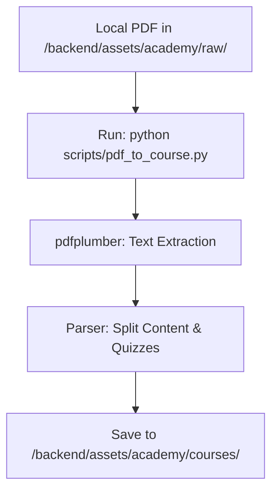

# LMS PoC — Implementation Specification

## 📊 Overview

### Purpose
The Learning Management System (LMS) PoC aims to provide a minimal, secure environment for IDH IDC users to access course materials and validate their knowledge through interactive quizzes.

### Key Principle
**Content-as-Data**: All course materials and quizzes are served as structured JSON, allowing for rapid iteration without heavy database migrations during the PoC phase.

### User Experience
- **Login**: Users authenticate via the existing IDC login.
- **Library**: Users browse available courses in the "Academy" section.
- **Chapter Layout**: Users first enter **Reading Mode** (Markdown-rendered content).
- **Quiz**: A "Test Your Knowledge" button at the bottom of the reading material triggers the `react-quiz-component` for that chapter.
- **Persistence**: Progress is stored as **JSON files on the backend**. Completion of a quiz unlocks the next chapter.

---

## 🎯 Design Principles
- **Admin-Only Transformation**: The PDF-to-JSON transformer is a **CLI-only script** accessible exclusively from within the **backend container**. There is no web UI for transformation in the PoC.
- **Stateless Quizzes**: Quiz logic runs entirely on the client-side for high performance, but results are posted to the backend for progress tracking.

---

## 📐 Architecture Design

### Data Flow for PDF Transformation

### Data Structure
Courses are stored as JSON files with the following structure:
- `courseId`: string
- `chapters`: Array
    - `id`: string
    - `content`: string (Markdown/Text)
    - `quiz`: Object (react-quiz-component schema)

---

## 🔧 Implementation Details

### Phase 1: Core Academy UI
- [ ] Create `/academy` and `/academy/:courseId` routes in React.
- [ ] Integrate `react-quiz-component`.
- [ ] Implement manual JSON loading from static assets.

### Phase 2: PDF Transformer (Local Script)
- [ ] Create `backend/scripts/pdf_to_course.py`.
- [ ] Set up `pdfplumber` for text extraction.
- [ ] Implement Chapter detection and content mapping.
- [ ] Create a basic parser to identify "Questions" and "Answers".

### Phase 3: Progress Sync
- [ ] Create `GET/POST /api/academy/progress` endpoints.
- [ ] Update `user_progress` storage (Local JSON for PoC).

---

## 📡 API Reference

### Course Materials
- **Method**: `GET`
- **Path**: `/api/v1/academy/courses`
- **Response**: `200 OK` (List of course metadata for the library)

- **Method**: `GET`
- **Path**: `/assets/academy/courses/{id}.json`
- **Response**: `200 OK` (Detailed course structure)

### Sync Progress
- **Method**: `POST`
- **Path**: `/api/v1/academy/progress`
- **Request Body**: `{ "course_id": "str", "chapter_id": "str", "score": int }`
- **Response**: `200 OK`

---

## ✅ Implementation Checklist
- [ ] Verify `react-quiz-component` compatibility with current React version.
- [ ] Ensure PDF parsing handles multi-column layouts.
- [ ] Audit role-based access for the transformer endpoint.
