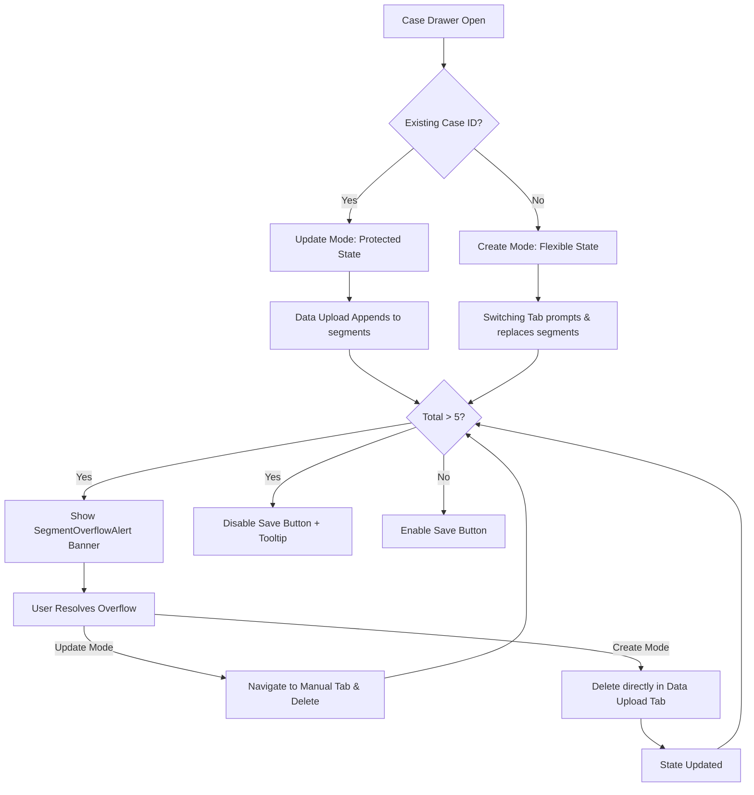

# Segmentation – Case Detail Update Behavior — Implementation Specification

## 📊 Overview

### Purpose
Previously, farming segments were often lost when updating case details. This feature ensures that segments are preserved during the update flow unless explicitly deleted. It also enforces a strict 5-segment limit with a "safe and stable" UX that differentiates between creating a new case and updating an existing one.

### Key Principle: Stability & Persistence
> [!IMPORTANT]
> **Condition-Based Persistence (The "Stability" Rule)**:
> - **Update Mode (Existing Case)**: Saved data is strictly protected. Previously saved segments (with database IDs) are **never** auto-deleted. New segments from Data Upload are **appended** to existing segments.
> - **Create Mode (New Case)**: Standard ephemeral behavior is maintained, but with a **Switching Guard**. Switching tabs will prompt the user and replace the segment state to ensure data source consistency.
> - **Strict 5-Segment Limit (FE & BE)**: Both Frontend and Backend must enforce a maximum of 5 segments. The Backend returns a 400 error if exceeded, and the Frontend provides a persistent overflow alert and blocks saving until resolved.

---

## 🐛 Current Bug Situation

### 1. Invisible State Clearing & Backend Accumulation
Currently, when a user edits an existing case and switches to the **Data Upload** tab, any previously saved segments are unconditionally cleared from the **frontend state** (UI). However, when the user selects a new variable and saves the case, the backend **appends** the new segments to the existing ones. 

**Resulting Bug**: If a user has 3 existing segments and adds 4 more via Data Upload, they end up with **7 segments in total** after updating. This results in an invalid state (> 5 segments) that is hidden from the user during the editing process but visible (and broken) after the update is complete.

### 2. Unvalidated Segment Overflow
The tool currently lacks strict enforcement of the **MAX_SEGMENT = 5** limit during the segmentation update flow. This allows users to:
- Generate > 5 segments via data upload.
- End up with a mix of manual and uploaded segments that exceed the UI's layout capacity.
- Attempt to save cases with invalid segment counts, leading to unhandled backend errors.

### 3. Workflow Inconsistency
There is no distinction between "Draft" state (New Case) and "Protected" state (Existing Case), which leads to a confusing UX where users are unsure if switching tabs will result in data loss or state merging.

---

## 🎯 Design Principles
- **Targeted Protection**: Only segments with a database `id` are protected from auto-deletion.
- **Tab Guarding (Create)**: Prevent mixing manual and upload sources in new cases by prompting users when switching.
- **Visual Stability**: Use `SegmentOverflowAlert` banners and real-time uniqueness validation to guide users.

---

## 📐 Architecture Design

### Logic Flow (Update vs Create)

---

## ✅ Acceptance Criteria

### User Acceptance Criteria (User AC)
- [ ] **Preservation (Update)**: Saved segments (with IDs) are preserved during tab switching and variable changes.
- [ ] **Tab Guarding (Create)**: Switching between Manual and Upload tabs in a new case triggers a `Modal.confirm` if segments exist, asking to replace/reset the state.
- [ ] **Overflow Alert**: A prominent banner appears if segment count > 5, detailing the current count and required action.
- [ ] **Categorical Guard**: In Data Upload, selecting a variable with > 5 categories shows a warning before generating segments.
- [ ] **Uniqueness**: Frontend highlights segments with duplicate names and blocks saving.

### Technical Acceptance Criteria (Tech AC)
- [ ] Backend `POST /case` and `PUT /case/{id}` return `400` if `segments.length > 5`.
- [ ] Pydantic `CaseBase` model enforces `max_items=5` for `segments`.
- [ ] `CaseForm.js` implements `Modal.confirm` on `onTabChange` for new cases.
- [ ] `SegmentConfigurationForm.js` logic updated to `concat` segments in Update mode.

---

## 🔧 Implementation Details

### Phase 1: Frontend Context Logic
- [ ] Modify `CaseForm.js`: Detect `currentCase.id` to set the `isUpdateMode` flag.
- [ ] **Tab Guard (Create)**: In `onTabChange`, if `!isUpdateMode` and segments are dirty, show `Modal.confirm` to clear the context before switching.
- [ ] Update `resetDataUploadForm`:
    - In Update mode: Only clear segments without an `id`.
    - In Create mode: Clear all.

### Phase 2: UX Stability Components
- [ ] **SegmentOverflowAlert**: Dedicated alert component displayed at the top of the form when count > 5.
- [ ] **Categorical Guard**: Warning message in the variable dropdown if the category count is > 5.
- [ ] **Duplicate Validator**: Visual highlighting for duplicate segment names.

---

## 📡 Example Scenarios

### Scenario 1: Standard Update (Append)
- **Status**: Update Mode (Existing Case).
- **Current State**: 2 saved segments (ID: 101, 102).
- **Action**: User switches to "Data Upload" and generates 2 new segments (Draft A, Draft B).
- **Result**: State contains 4 segments (2 Saved + 2 Draft). Save enabled.

### Scenario 2: Update with Overflow (Manual Resolution)
- **Status**: Update Mode (Existing Case).
- **Current State**: 4 saved segments.
- **Action**: User switches to "Data Upload" and generates 3 new segments.
- **Result**: 7 segments total. **Overflow Alert Banner** appears.
- **Manual Action**: User navigates to "Manual" tab and deletes 2 saved segments.
- **Outcome**: Save enabled once count is 5.

### Scenario 3: Create Mode (Switching Guard)
- **Status**: Create Mode (New Case).
- **Current State**: 3 draft segments in "Manual" tab.
- **Action**: User clicks "Data Upload" tab.
- **System Action**: Modal appears: "Switching to Data Upload will clear your manual segments. Proceed?".
- **User Action**: Clicks "OK".
- **Result**: Manual segments are cleared, tab switches to Upload.

### Scenario 4: Categorical Variable Safety Guard
- **Status**: Any Mode.
- **Action**: User selects a variable with 15 categories.
- **System Action**: Warning appears. Generation is blocked.
### Scenario 5: Create Mode - Direct Deletion (Data Upload Tab)
- **Status**: Create Mode (New Case).
- **Tab**: Data Upload.
- **Action**: User uploads a file and selects a variable that generates 7 segments.
- **Result**: **Overflow Alert Banner** appears. 7 segments are visible in the "Data Upload" preview list.
- **Correction**: User clicks the **Delete icon** (garbage can) directly in the "Data Upload" preview row for 2 unwanted segments.
- **Outcome**: Count becomes 5. **Overflow Alert** disappears. Save enabled.
- **Note**: This differs from **Update Mode**, where saved segments (with IDs) are protected and must be deleted from the "Manual Data Input" tab to ensure intentional data removal.

---

## ✅ Implementation Checklist
- [ ] Tab Switch Guard (Create Mode) verified.
- [ ] Segment retention (Update Mode) verified.
- [ ] Overflow banner displays correctly.
- [ ] Save button disabled at > 5.
- [ ] Duplicate name validation working.
- [ ] Backend 400 error caught and handled.
