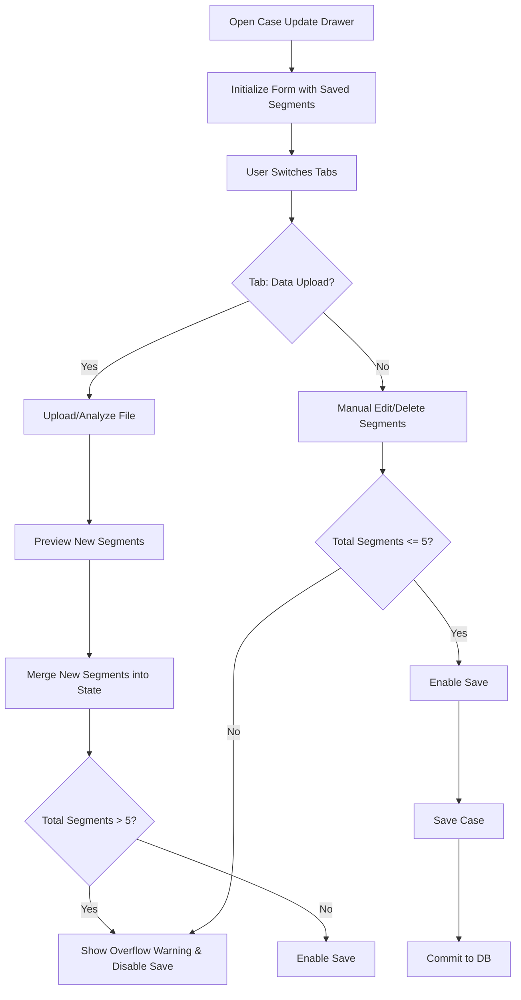

# Segmentation – Case Detail Update Behavior — Implementation Specification

## 📊 Overview

### Purpose
Previously, farming segments were often lost when updating case details, especially when switching between the "Manual Data Input" and "Data Upload" tabs. This feature ensures that all segments (both manually defined and data-driven) are preserved during the update flow unless explicitly deleted. It also enforces a strict 5-segment limit. If adding new segments via Data Upload exceeds this limit, the user must manually decide which segments to keep and which to delete before they can save.

### Key Principle
**User-Centric Curation**: Users have full control over their segmentation. The system provides the data but stays out of the way of the final decision on which segments are preserved.

### User Experience
When a user updates a case, they can switch tabs without data loss. If they have 3 existing segments and use "Data Upload" to generate 4 more, the total becomes 7. The system will alert the user that they are over the limit and block the "Save" button. The user must then go to the "Manual Data Input" tab and manually delete segments until they are back to 5 or fewer.

---

## 🎯 Design Principles
- **State Preservation**: The `segments` array in the form state should be treated as the source of truth, initialized from the database and only modified by additive or explicitly subtractive actions.
- **Manual Resolution**: Avoid automated "overwriting" or "merging" logic that might delete valuable user data. Force a manual decision instead.
- **Strict Validation**: Prevent "accidental" overflows by blocking saves that exceed the segment limit at both the UI and API layers.

---

## 📐 Architecture Design

### Data Flow / Logic Flow

### Database Schema / Data Structure
- No changes to the database schema are required.
- The `CaseBase` Pydantic model will be updated to include a validator for the `segments` field.

---

## ✅ Acceptance Criteria

### User Acceptance Criteria (User AC)
- [ ] Previously saved segments are preserved when switching between "Manual Data Input" and "Data Upload" tabs.
- [ ] Creating segments via the Data Upload flow **appends** to the existing segment list rather than wiping it.
- [ ] Users see a "Maximum 5 segments allowed" warning if the combined total (Existing + New) exceeds 5.
- [ ] The "Save case" button is disabled as long as the segment count is > 5.
- [ ] Users must navigate to the "Manual Data Input" tab to delete unwanted segments.

### Technical Acceptance Criteria (Tech AC)
- [ ] Backend `POST /case` and `PUT /case/{id}` return `400 Bad Request` if `segments.length > 5`.
- [ ] Frontend `CaseSettings.js` disables the "Save case" button and shows a specific tooltip if `segments.length > 5`.
- [ ] `SegmentConfigurationForm.js` logic updated to **append** segments to the existing `segments` array instead of overwriting.
- [ ] Pydantic `CaseBase` model uses `max_items=5` for the `segments` field.

---

## 🔧 Implementation Details

### Phase 1: Frontend State Append & Preservation
- [ ] Modify `CaseForm.js` -> `resetDataUploadForm` to preserve segments that have an `id`.
- [ ] Update `SegmentConfigurationForm.js` fetch preview logic to **append** results to existing `segments` instead of `form.setFieldsValue({ segments })`.
- [ ] Ensure `onRemove` in `CaseForm` only clears the `import_id` and data-upload-specific fields, retaining saved segments.

### Phase 2: Multi-Level Validation
- [ ] Update `backend/models/case.py` to add Pydantic validation for segment count.
- [ ] Update `backend/routes/case.py` to add explicit logic checks in create/update endpoints.
- [ ] Enhance `CaseSettings.js` with a hard block in `onFinish` if validation is bypassed by the UI state.
- [ ] Update `CaseSettings.js` `isSaveDisabled` logic to react to the combined segment count.

---

## 📡 API Reference

### Create/Update Case
- **Method**: `POST /case` | `PUT /case/{id}`
- **Path**: `/api/v1/case`
- **Response**: 
  - `200 OK`: Success
  - `400 Bad Request`: "Failed to save: Total number of segments cannot exceed 5."

---

## ✅ Implementation Checklist
- [ ] Unit tests for backend segment count validation.
- [ ] Manual verification of tab-switching persistence.
- [ ] UI verification: Append 3 new segments to 3 existing ones -> verify block.
- [ ] UI verification: Delete segments until 5 -> verify save enabled.
- [ ] Documentation updated in `agent_docs/sprint-plan.md`.

---

## 📊 Example Scenarios

### Scenario 1: Appending Segments
- **Input**: User has 3 saved segments.
- **Action**: Switches to "Data Upload", uploads a file that returns 4 segments.
- **Result**: State now contains 7 segments (3 old, 4 new).
- **Outcome**: "Save" button is disabled. A warning tells the user to delete 2 segments.

### Scenario 2: Over-segmentation Resolution
- **Input**: User has 7 segments (overflow).
- **Action**: User goes to "Manual Data Input" tab and deletes 2 segments.
- **Outcome**: Count becomes 5. "Save" button is enabled.

---

## 🔮 Future Enhancements
- **Auto-Merging**: Intelligent suggestion for merging overlapping numerical segments.
- **Conflict Highlighting**: Highlight if a new data-driven segment name conflicts with an existing one.
