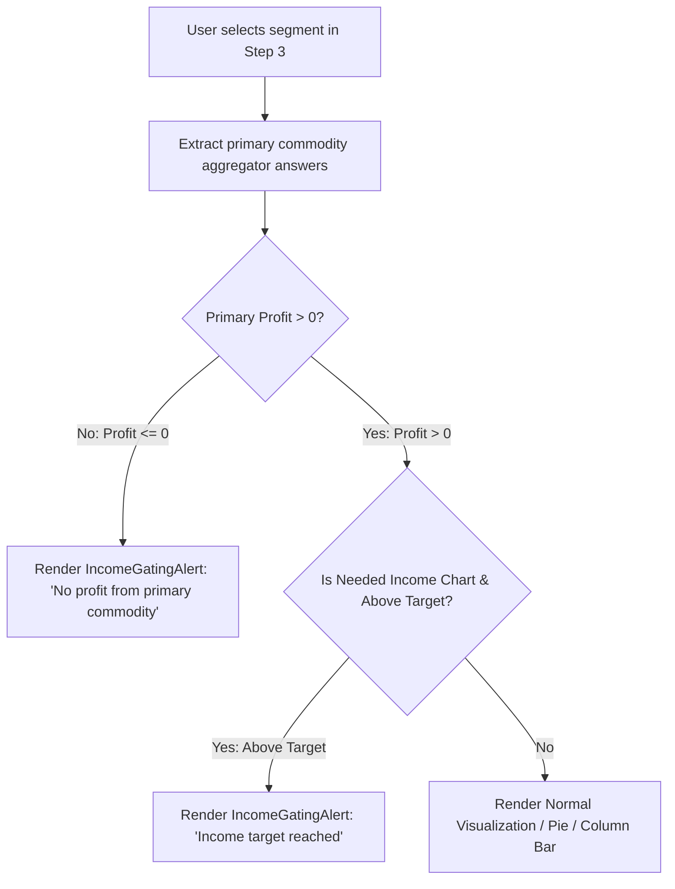

# Feature Specification: Disable Negative Income Features in Step 3

## 1. Overview & 5W1H Analysis

- **Who**: Value chain analysts, field officers, and sustainability managers reviewing Step 3 (Assess Farm Economics & Income Gap).
- **What**: Conditionally disable visualizations and render an informative notification when a farmer segment does not generate positive profit from their primary commodity (focus crop).
- **Where**:
  - `frontend/src/pages/cases/components/IncomeGatingAlert.js`
  - `frontend/src/pages/cases/visualizations/ChartHouseholdIncomeComposition.js`
  - `frontend/src/pages/cases/visualizations/ChartNeededIncomeLevel.js`
- **When**: Displayed when a user selects a segment where primary commodity net profit is $\le 0$ on Step 3.
- **Why**: When focus crop costs outweigh revenues (negative profit), proportional calculations produce nonsensical or distorted results (e.g. negative percentage shares, $>1000\%$ pie chart slices, or inverted gap allocations).
- **How**: Generalize `IncomeGatingAlert` to support customizable `title` and `description` props, compute `primaryIncome <= 0` from dashboard answers in both Step 3 visualizations, and render the gating alert instead of the chart while preserving segment selection.

---

## 2. Requirements & UI Copy

### 2.1 Gating Alert Specifications
When a selected segment has primary commodity income $\le 0$:
- **Title**: `No profit from primary commodity`
- **Description**: `Farmers in this segment do not generate a positive profit from their primary commodity. This feature is therefore disabled because the calculation is not meaningful for this segment.`
- **Styling**: IDC branded alert styling (`#eaf2f2` background, `#01625f` border, rounded corners, info icon).

### 2.2 Affected Step 3 Visualizations
1. **Household Income Composition (`ChartHouseholdIncomeComposition.js`)**:
   - Keep `<SegmentSelector />` mounted at the top.
   - If `primaryIncome <= 0`, replace the pie chart with `<IncomeGatingAlert />`.
   - Preserve explanatory text below the divider.
2. **Additional Income Needed by Income Source (`ChartNeededIncomeLevel.js`)**:
   - Keep `<SegmentSelector />` mounted at the top.
   - If `primaryIncome <= 0`, render `<IncomeGatingAlert title="No profit from primary commodity" description="..." />`.
   - If `primaryIncome > 0` but `total_current_income >= target`, render `<IncomeGatingAlert title="Income target reached" description="..." />`.
   - Otherwise, render the grouped column chart.

---

## 3. Architecture & Logic Flow



---

## 4. Touchpoint Files

| Operation | File Path | Scope |
| :--- | :--- | :--- |
| `[MODIFY]` | `frontend/src/pages/cases/components/IncomeGatingAlert.js` | Add configurable `title` & `description` props with backward-compatible defaults |
| `[MODIFY]` | `frontend/src/pages/cases/visualizations/ChartHouseholdIncomeComposition.js` | Import `IncomeGatingAlert`, evaluate `isNoPrimaryProfit`, conditionally render alert |
| `[MODIFY]` | `frontend/src/pages/cases/visualizations/ChartNeededIncomeLevel.js` | Evaluate `isNoPrimaryProfit` and render respective gating alert |
| `[CREATE]` | `docs/features/DISABLE_NEGATIVE_INCOME_FEATURES.md` | Feature specification and documentation alignment |

---

## 5. Verification Plan

### Automated Checks

```bash
./dc.sh exec frontend yarn lint
./dc.sh exec frontend yarn test:ci
```

### Manual Verification Scenarios

1. **Negative Primary Profit ($COP > Revenue$)**:
   - Select segment with negative primary margin -> Verify both Step 3 charts display "No profit from primary commodity" alert.
2. **Zero Primary Profit ($Profit = 0$)**:
   - Select segment with zero primary income -> Verify both charts display the alert.
3. **Profitable Primary Segment ($Profit > 0$)**:
   - Select segment with positive focus crop earnings -> Verify normal chart rendering.
4. **Above Target Precedence in Needed Income Chart**:
   - Select profitable segment that exceeds target -> Verify "Income target reached" alert displays.
5. **Segment Switch Interactivity**:
   - Toggle between profitable and unprofitable segments via `SegmentSelector` -> Verify smooth reactive updates.

---

## 6. Vibe Coding Estimation Standard

| Task ID | Story / Task Description | 💻 Vibe Coding (Dev) | 🧪 Automated Testing | 🔍 QA & Review | Total Est. |
| :--- | :--- | :---: | :---: | :---: | :---: |
| **#833-01** | **IncomeGatingAlert Generalization**: Add configurable `title` & `description` props with backward-compatible defaults | 10m | 5m | 5m | **20m (0.3h)** |
| **#833-02** | **Step 3 Household Income Composition Gating**: Implement `isNoPrimaryProfit` calculation and alert rendering | 20m | 10m | 5m | **35m (0.6h)** |
| **#833-03** | **Step 3 Needed Income Level Gating**: Add `isNoPrimaryProfit` evaluation alongside `isAboveTarget` | 20m | 10m | 5m | **35m (0.6h)** |
| **#833-04** | **Cross-Segment & QA Validation**: Verify segment selector transitions, negative test cases, and frontend lint | 10m | 15m | 5m | **30m (0.5h)** |
| **TOTAL** | **Full Feature Implementation** | **1h 00m** | **40m** | **20m** | **2h 00m (2.0h)** |
