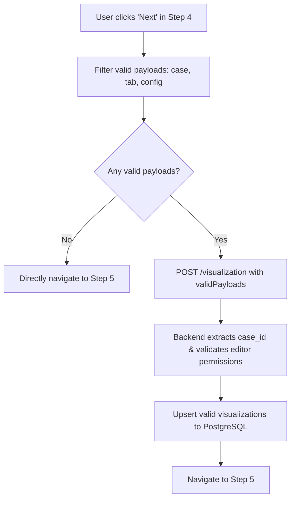

# Bug Fix Specification: Fix Step 4 to Step 5 Navigation & Visualization Save Error

## 1. Overview & 5W1H Analysis

- **Who**: Users navigating from Step 4 ("Assess Impact of Mitigation Strategies") to Step 5 ("Closing the Gap").
- **What**: Fix an error toast ("Failed to save assess impact of mitigation strategies") that blocks navigation to Step 5 when cases have only one visualization tool configured (or uninitialized tools).
- **Where**:
  - `frontend/src/pages/cases/steps/AssessImpactMitigationStrategies.js`
  - `backend/routes/visualization.py`
  - `backend/db/crud_visualization.py`
  - `backend/tests/test_080_visualization.py`
- **When**: Triggered immediately when clicking the "Next" button on Step 4.
- **Why**: Step 4 was sending an unfiltered array `payloads = [sensitivityAnalysis, scenarioModeling]`. When one of the tools is uninitialized or lacks `case`/`tab`/`config`, the backend was reading `case_id = payload[0].get("case")` (which resulted in `None`), failing authorization with a 403 error and triggering database integrity constraint violations on insert.
- **How**:
  1. Filter `payloads` on the frontend before sending so only valid, non-empty objects with `case`, `tab`, and `config` are dispatched.
  2. Defensively extract `case_id` on the backend by searching all payload elements for a valid `case` property.
  3. Filter/sanitize payloads in the backend CRUD layer to skip invalid items.
  4. Add hermetic regression tests.

---

## 2. Requirements & Bug Fix Strategy

### 2.1 Frontend Defense (`AssessImpactMitigationStrategies.js`)
- Construct `validPayloads` by filtering `[sensitivityAnalysis, scenarioModeling]` with:
  ```javascript
  const validPayloads = [sensitivityAnalysis, scenarioModeling].filter(
    (p) => !isEmpty(p?.config) && p?.case && p?.tab
  );
  ```
- If `validPayloads.length === 0`:
  - Reset loading state.
  - If `allowNavigate` is true, immediately navigate to Step 5 without making an unnecessary API request.
- If `validPayloads.length > 0`:
  - Dispatch only `validPayloads` via `api.sendCompressedData`.

### 2.2 Backend Defense (`visualization.py` & `crud_visualization.py`)
- In `backend/routes/visualization.py`:
  - Defensively resolve `case_id = next((item.get("case") for item in payload if item.get("case")), None)`.
  - If `case_id` is missing or None, raise `HTTPException(status_code=400, detail="Valid case ID required in payload")`.
- In `backend/db/crud_visualization.py`:
  - Skip any payload item missing `case`, `tab`, or `config` to prevent `IntegrityError` (Not-Null constraint violations on pg.JSONB or Enum).

---

## 3. Architecture & Data Flow



---

## 4. Touchpoint Files

| Operation | File Path | Scope |
| :--- | :--- | :--- |
| `[MODIFY]` | `frontend/src/pages/cases/steps/AssessImpactMitigationStrategies.js` | Filter visualization payloads before sending, allow clean direct navigation when empty |
| `[MODIFY]` | `backend/routes/visualization.py` | Defensively extract `case_id` and validate request payload |
| `[MODIFY]` | `backend/db/crud_visualization.py` | Skip uninitialized or malformed payload items |
| `[TEST]` | `backend/tests/test_080_visualization.py` | Add unit tests for partial/empty payload arrays |
| `[CREATE]` | `docs/features/FIX_STEP5_VISUALIZATION_SAVE_ERROR.md` | Bug specification & verification notes |

---

## 5. Verification Plan

### Automated Checks

```bash
./dc.sh exec backend pytest backend/tests/test_080_visualization.py -v
./dc.sh exec frontend yarn lint
./dc.sh exec frontend yarn test:ci
```

### Manual Verification Scenarios

1. **Partial Data Case**:
   - Open a case with only `scenarioModeling` configured (e.g. Uganda Clustering GCP).
   - Click "Next" on Step 4 -> Verify successful navigation to Step 5 without error alerts.
2. **Unmodified Case**:
   - Open a new case, navigate to Step 4 without changing anything, and click "Next" -> Verify smooth navigation to Step 5.
3. **Full Data Case**:
   - Make edits to both single driver exploration and advanced modelling -> Click "Next" -> Verify data saves and navigation succeeds.

---

## 6. Vibe Coding Estimation Standard

| Task ID | Story / Task Description | 💻 Vibe Coding (Dev) | 🧪 Automated Testing | 🔍 QA & Review | Total Est. |
| :--- | :--- | :---: | :---: | :---: | :---: |
| **#834-01** | **Frontend Payload Sanitization**: Filter visualization payloads in `AssessImpactMitigationStrategies.js` | 15m | 10m | 5m | **30m (0.5h)** |
| **#834-02** | **Backend Defensive Validation**: Robust `case_id` extraction & sanitization in `visualization.py` & `crud_visualization.py` | 15m | 15m | 5m | **35m (0.6h)** |
| **#834-03** | **Regression Tests & QA**: Add unit tests in `test_080_visualization.py` & manual navigation verification | 10m | 15m | 10m | **35m (0.6h)** |
| **TOTAL** | **Full Bug Fix & Verification** | **40m** | **40m** | **20m** | **1h 40m $\rightarrow$ ~1.5h** |
