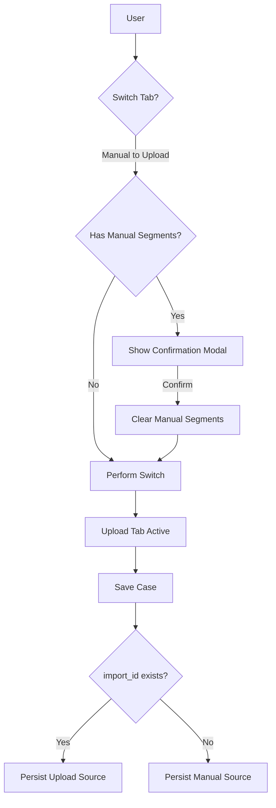

# Mutually Exclusive Segmentation — Implementation Specification

## 📊 Overview

### Purpose
The Income Driver Calculator (IDC) currently allows segments created through manual input and data upload to coexist. This leads to configuration conflicts, UI clutter (exceeding the 5-segment limit), and confusion regarding the source of truth for farmer data. This feature enforces a strict "One Source" rule for segmentation.

### Key Principle
**Implicit Source of Truth**: The system determines the segmentation method based on the presence of an `import_id`. This avoids complex backend schema changes while ensuring data integrity.

### User Experience
Users choose between "Manual data input" and "Data upload". Switching between these methods requires explicit confirmation, which clears the competing data to maintain a clean workspace and respect the 5-segment limit.

---

## 🎯 Design Principles
- **Mutual Exclusivity**: A case can only have segments from ONE method (Manual OR Upload).
- **Graceful Degradation**: Existing upload-based cases that lack the original spreadsheet session will guide the user to re-upload to "unlock" advanced calculations.
- **Clear Guidance**: The UI provides immediate feedback (Alerts) if a user attempts to edit segments in the "wrong" tab.

---

## 📐 Architecture Design

### Data Flow / Logic Flow

### Database Schema / Data Structure
No database schema changes are required for the "Low-Effort" implementation.
- **Source Indicator**: `case.import_id`
  - `import_id != null` => Data Upload Source
  - `import_id == null` => Manual Source

---

## 🔧 Implementation Details

### Phase 1: Frontend Guards & State Logic
- [ ] **Tab Interception**: Update `CaseForm.js` to use `Modal.confirm` on `onTabChange`.
- [ ] **State Reset**: Clear the relevant form fields (`segments` vs `import_id`) upon confirmed switch.
- [ ] **Read-Only Implementation**: Add `Alert` components to `SegmentForm.js` and `SegmentConfigurationForm.js` to explain restricted states.
- [ ] **Button Disabling**: Disable "Add Segment" and "Delete" buttons in `SegmentForm` if `import_id` exists.

### Phase 2: Backend Consistency
- [ ] **CRUD Alignment**: Update the backend case update handler to ensure any existing `CaseImport` links are removed if a case is saved with `import_id = null`.

---

## 📡 API Reference

### Update Case (Existing)
- **Method**: `PUT`
- **Path**: `/case/{id}`
- **Logic Change**: The backend must now explicitly handle the clearing of `CaseImport` associations if `import_id` is passed as `null` or omitted in a manual save context.

---

## ✅ Implementation Checklist
- [ ] Tab switches trigger confirmation modals when data exists.
- [ ] Manual segments are cleared when switching to Upload.
- [ ] `import_id` is cleared when switching to Manual.
- [ ] UI displays "Read-only" alert in the manual tab for upload-based cases.
- [ ] Total segment count never exceeds 5.
- [ ] Unit tests for state clearing logic.

---

## 📊 Example Scenarios

### Scenario 1: Switching from Manual to Upload
1. User defines 3 segments in "Manual data input".
2. User clicks "Data upload" tab.
3. System shows: "Switching to Data Upload will clear your manual segments. Continue?"
4. User clicks "Confirm".
5. Manual segments are cleared; Upload tab becomes active.

---

## 🔮 Future Enhancements
- **Segment Persistence**: Storing a history of previous segmentation attempts for easy restoration.
