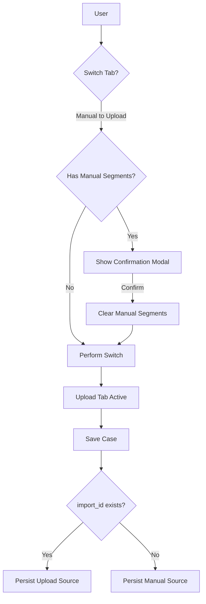

# [DRAFT/DEPRECATED] Mutually Exclusive Segmentation — Implementation Specification

> [!CAUTION]
> **This document is DEPRECATED.**
> It has been renewed and replaced by **[docs/SEGMENTATION_UPDATE_BEHAVIOR.md](/docs/SEGMENTATION_UPDATE_BEHAVIOR.md)**.
> Please refer to the new document for the approved logic regarding "Create Mode" vs "Update Mode" and the 5-segment limit stability features.

## 📊 Overview (Preserved for History)

### Purpose
The Income Driver Calculator (IDC) currently allows segments created through manual input and data upload to coexist. This leads to configuration conflicts, UI clutter (exceeding the 5-segment limit), and confusion regarding the source of truth for farmer data. This feature enforces a strict "One Source" rule for segmentation.

### Key Principle
**Implicit Source of Truth**: The system determines the segmentation method based on the presence of an `import_id`. This avoids complex backend schema changes while ensuring data integrity.

### User Experience
Users choose between "Manual data input" and "Data upload". Switching between these methods requires explicit confirmation, which clears the competing data to maintain a clean workspace and respect the 5-segment limit.

---

## 🎯 Design Principles
- **Mutual Exclusivity**: A case can only have segments from ONE method (Manual OR Upload).
- **Graceful Degradation**: Existing upload-based cases that lack the original spreadsheet session will guide the user to re-upload to "unlock" advanced calculations.
- **Clear Guidance**: The UI provides immediate feedback (Alerts) if a user attempts to edit segments in the "wrong" tab.

---

## 📐 Architecture Design

### Data Flow / Logic Flow

### Database Schema / Data Structure
No database schema changes are required for the "Low-Effort" implementation.
- **Source Indicator**: `case.import_id`
  - `import_id != null` => Data Upload Source
  - `import_id == null` => Manual Source

---

## 🔧 Implementation Details

### Optimized Roadmap
To achieve mutual exclusivity with minimal backend modification, the following sub-steps will be implemented:

| Phase | Task | Effort | Source / Strategy |
| :--- | :--- | :--- | :--- |
| **1. Tab Interception** | Implement `handleTabChange` with `Modal.confirm` in `CaseForm.js`. | 1.5h | Guard the Manual ↔ Upload switch. |
| **2. State Management** | Logic to clear `import_id` or `segments[]` on confirmed switch. | 1.0h | Reset form state for the "competing" source. |
| **3. UI Source Guards** | Add `Alert` and disable `Add Segment` buttons in the Manual tab. | 1.5h | High-level protection for upload-based cases. |
| **4. Re-upload guidance**| Implement "Unlock" prompt in `DataUploadSegmentForm` for new sessions. | 2.0h | Handle cases where `import_id` exists but the file is not in memory. |
| **5. Backend Clear** | Update the Case update service/router to clear import links. | 1.0h | Ensure manual saves detach previous imports. |
| **6. Verification** | QA of switch paths (Manual to Upload, Upload to Manual). | 1.0h | Final testing and rule compliance check. |

---

### Technical Sub-tasks
- [ ] **Tab Interception**: Update `CaseForm.js` to use `Modal.confirm` on `onTabChange`.
- [ ] **State Reset**: Clear relevant form fields (`segments` vs `import_id`) upon confirmed switch.
- [ ] **Read-Only Implementation**: Add `Alert` components to restricted views.
- [ ] **Button Disabling**: Disable "Add Segment" and "Delete" icons in `SegmentForm` if `import_id` exists.
- [ ] **CRUD Alignment**: Backend update to ensure `CaseImport` records are decoupled if `import_id` is null.

---

## 📡 API Reference

### Update Case (Existing)
- **Method**: `PUT`
- **Path**: `/case/{id}`
- **Logic Change**: The backend must now explicitly handle the clearing of `CaseImport` associations if `import_id` is passed as `null` or omitted in a manual save context.

---

## ✅ Implementation Checklist
- [ ] Tab switches trigger confirmation modals when data exists.
- [ ] Manual segments are cleared when switching to Upload.
- [ ] `import_id` is cleared when switching to Manual.
- [ ] UI displays "Read-only" alert in the manual tab for upload-based cases.
- [ ] Total segment count never exceeds 5.
- [ ] Unit tests for state clearing logic.

---

## 📊 Example Scenarios

### Scenario 1: Manual to Upload Switch
1.  **State**: User has defined 4 segments manually in the "Manual data input" tab.
2.  **Action**: User clicks the "Data upload" tab.
3.  **System Response**: A `Modal.confirm` appears: *"Switching to Data Upload will clear your manual segments to ensure the 5-segment limit is respected. Do you want to continue?"*
4.  **Confirmation**: User clicks "Confirm".
5.  **Result**: Manual segments are cleared from form state. The "Data upload" tab becomes active and empty.

### Scenario 2: Upload to Manual Switch
1.  **State**: User has successfully uploaded a file and generated 5 segments.
2.  **Action**: User clicks the "Manual data input" tab.
3.  **System Response**: A `Modal.confirm` appears: *"Switching to Manual Data Input will detach your uploaded data. You will need to define segments manually. Do you want to continue?"*
4.  **Confirmation**: User clicks "Confirm".
5.  **Result**: `import_id` is cleared from form state. The "Manual data input" tab becomes active and allows "Add Segment" actions.

### Scenario 3: Guarded / Read-Only View
1.  **State**: User opens an existing case that was created via Data Upload (`import_id` is present).
2.  **Action**: User navigates to the "Manual data input" tab to see the segment list.
3.  **System Response**:
    - An `Alert` (Info) is displayed at the top: *"These segments were generated via Data Upload. To modify the segmentation, please return to the Data Upload tab."*
    - The "Add Segment" button is **disabled**.
    - The "Delete" icons on individual segment rows are **disabled** or hidden.
4.  **Result**: Data integrity is maintained by forcing the user back to the original source for modifications.

---

## 🔮 Future Enhancements
- **Segment Persistence**: Storing a history of previous segmentation attempts for easy restoration.
