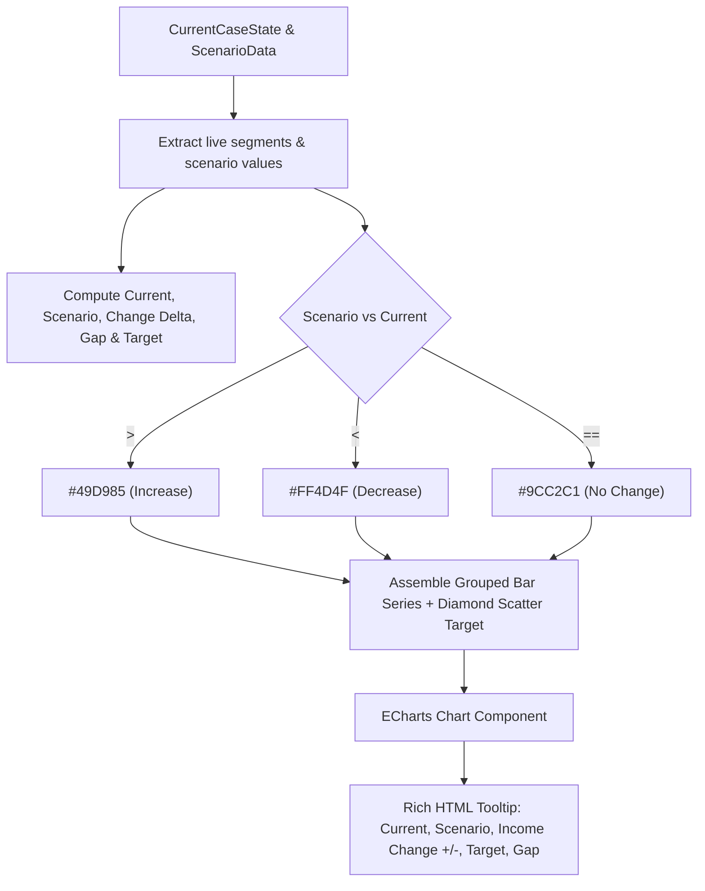

# Feature Specification: Rework Scenario Modelling Graph

## 1. Overview & 5W1H Analysis
- **Who**: Value chain analysts, field officers, and sustainability managers evaluating living income closure strategies.
- **What**: Rework the primary "Optimal driver values to reach your target" visualization on Step 5 (Closing the Gap) from a stacked bar chart to a grouped column bar chart showing baseline vs. scenario outcomes with an overlaid Income Target diamond marker.
- **Where**: `frontend/src/pages/cases/visualizations/ChartSegmentsIncomeGapScenarioModeling.js` (rendered in `ScenarioModelingIncomeDriversAndChart.js`).
- **When**: Displayed immediately when viewing Scenario Modeling in Step 5 for any selected scenario.
- **Why**: The previous stacked chart hid income reductions or filtered out segments with losses, preventing users from seeing the full cross-segment impact of complex interventions (such as increased COP or crop diversification trade-offs).
- **How**: Convert the visualization to a grouped bar series (Current Income vs. Scenario Income) where Scenario Income dynamically changes color based on the outcome (growth, reduction, or no change). Overlap the Income Target as a black diamond marker. Present detailed Gap and Income Change in the interactive hover tooltip.

---

## 2. Requirements & Visual Specifications

### 2.1 Chart Structure (Grouped Bar Chart)
1. **X-Axis**: All farmer segments (no segment filtering; all segments always visible).
2. **Y-Axis**: Income in active case currency (e.g., `Income KES`, `Income USD`), supporting both positive and negative values without artificial flooring at 0.
3. **Bar Series (Grouped per Segment)**:
   - **Bar 1 — Current Income**:
     - Label: `Current income` (or `Current total household income`)
     - Color: Dark IDH Green (`#1B625F`)
   - **Bar 2 — Scenario Income**:
     - Label: `Scenario income` (or `Modelled income`)
     - Dynamic Color based on comparison with Current Income:
       - **Increase** (`Scenario > Current`): Light Green (`#49D985`)
       - **Decrease** (`Scenario < Current`): Red (`#FF4D4F`)
       - **No Change** (`Scenario == Current`): Light Green / Teal (`#9CC2C1`)
4. **Income Target Marker**:
   - Rendered as a black diamond (`#000000`) point overlaid across the segment group.
5. **Legend Specifications**:
   - Includes distinct legend entries for all outcome states: `Current total household income` (`#1B625F`), `Scenario income (increase)` (`#49D985`), `Scenario income (decrease)` (`#FF4D4F`), `Scenario income (no change)` (`#9CC2C1`), and `Income Target` (`#000000`).
6. **Partial Driver Selection Calculation Safeguard**:
   - When users select fewer than 5 drivers (e.g. only modifying `Land`), `calculateChildrenValues` preserves baseline values from `targetSegment.answers` for un-modeled variables (Volume, Price, COP) instead of evaluating missing variables to `0`.
7. **Removal of Segment Filtering & Alert**:
   - Revert the exclusion rule that previously hid segments with income decreases.
   - Remove the Ant Design `<Alert>` banner ("This graph only shows segments with improved or unchanged income...").

---

### 2.2 Interactive Tooltip & Value Labels
When hovering over bars or segment clusters:
- **Segment Name**: Displayed as header.
- **Current Total Household Income**: Formatted currency value.
- **Scenario Income**: Formatted currency value with outcome indicator.
- **Income Change**:
  - If positive: `+X <Currency>`
  - If negative: `-X <Currency>`
  - If zero: `0 <Currency>`
- **Income Target**: Formatted benchmark currency value.
- **Gap**: Difference between Income Target and Scenario Income (`Math.max(0, Target - Scenario)`).

---

### 2.3 Edge Case & Negative Value Support
- **Negative Crop/Household Income**: Ensure `Math.max(0, ...)` clamping is eliminated from calculation routines so that negative net margins correctly extend downward below the horizontal baseline (0).
- **Zero Delta / No Change**: Ensure correct teal styling when scenario values match baseline.
- **Surplus Beyond Target**: Tooltip handles scenarios where farmer income surpasses the benchmark without showing negative gap clutter.

---

## 3. Architecture & Data Flow



---

## 4. Touchpoint Files

| Operation | File Path | Scope |
| :--- | :--- | :--- |
| `[MODIFY]` | `frontend/src/pages/cases/visualizations/ChartSegmentsIncomeGapScenarioModeling.js` | Remove Alert, convert to grouped bar structure, implement dynamic color rules, remove 0-floor clamping, build custom tooltip |
| `[CREATE]` | `docs/features/REWORK_SCENARIO_MODELLING_GRAPH.md` | Feature specification and architectural alignment |

---

## 5. Verification Plan

### Automated Checks
```bash
./dc.sh exec frontend yarn lint
./dc.sh exec frontend yarn test:ci
```

### Manual Verification Scenarios
1. **Scenario with Mixed Outcomes**:
   - Segment 1: Yield increase -> Green bar (`#49D985`).
   - Segment 2: COP increase / Land reduction -> Red bar (`#FF4D4F`).
   - Segment 3: No driver changes -> Teal bar (`#9CC2C1`).
2. **Negative Margin Test**:
   - Configure a segment with high cost of production resulting in negative income -> Bar extends below zero.
3. **Tooltip Inspection**:
   - Hover over each segment: Verify exact numbers for Current Income, Scenario Income, Income Change (+/-), Target, and remaining Gap.
4. **Export & Labels**:
   - Toggle "Show label": Verify numbers display at the top of each bar.
   - Click "Export": Verify downloaded PNG includes both bars and target diamonds clearly.

---

## 6. Vibe Coding Estimation Standard

| Task ID | Story / Task Description | 💻 Vibe Coding (Dev) | 🧪 Automated Testing | 🔍 QA & Review | Total Est. |
| :--- | :--- | :---: | :---: | :---: | :---: |
| **#832-01** | **Data Extraction & Filter Removal**: Remove segment filter & Alert; eliminate `Math.max(0, ...)` clamping for negative support | 15m | 10m | 5m | **30m (0.5h)** |
| **#832-02** | **Grouped Bar & Target Configuration**: Build 2-bar grouped series with dynamic outcome colors + diamond Income Target overlay | 30m | 15m | 15m | **60m (1.0h)** |
| **#832-03** | **Rich Tooltip & Label Formatter**: Implement custom HTML tooltip with Income Change (+/-), Gap, and formatted currency labels | 25m | 15m | 10m | **50m (0.8h)** |
| **#832-04** | **Edge Cases & Visual QA**: Validate negative incomes, no-change teal state, export PNG fidelity, and frontend lint pass | 10m | 20m | 10m | **40m (0.7h)** |
| **TOTAL** | **Full Feature Implementation** | **1h 20m** | **1h 00m** | **40m** | **3h 00m (3.0h)** |
